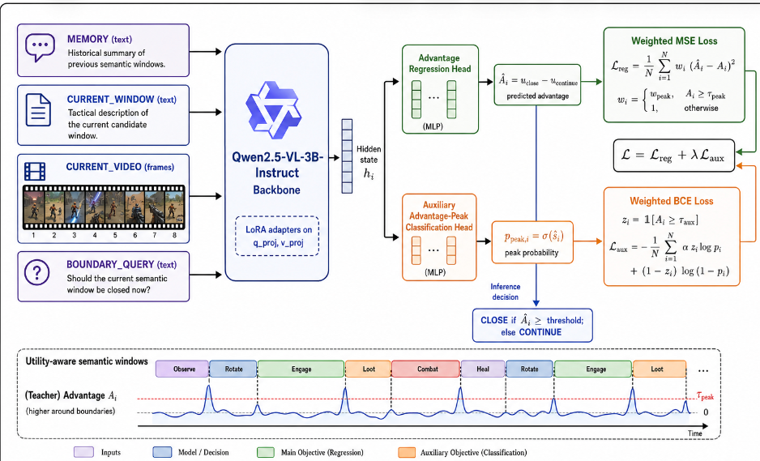

# EpiStream: Utility-Aware Temporal Abstraction for Dense-Action Streams

Code release for the NeurIPS 2026 submission:

> **EpiStream: Utility-Aware Temporal Abstraction for Dense-Action Streams**
> Anonymous Author(s)

## Overview

EpiStream is an online framework for utility-aware semantic episode formation in dense-action streams (DAS). Instead of detecting event boundaries, EpiStream learns *when* an evolving video prefix should be committed into an episode unit that maximizes downstream utility under a fixed memory budget.

The framework consists of three components:
1. **Utility Function Design** — jointly captures semantic coherence, inter-episode distinctiveness, and downstream objectives.
2. **Offline Utility-Optimal Episode Construction** — converts privileged telemetry into dense commit-advantage teaching signals.
3. **Online Peak-Aware Commitment Policy** — trains a causal VLM policy via joint advantage regression and auxiliary peak prediction.

This repository contains code plus the released EpiStream LoRA checkpoint.
Raw telemetry logs, screenshots, cached memory cards, and private API
credentials are intentionally excluded from the public release.

For the shortest path to the paper numbers, start with `REPRODUCE.md`.

## Method Overview

<p align="center">
  
</p>

## Repository Structure

```text
EpiStream/
├── REPRODUCE.md
├── MODEL_RELEASE.md
├── requirements.txt
├── src/
│   ├── map.py                         # tlog parsing and semantic evidence mapping
│   ├── metrics.py                     # paper metric primitives
│   ├── segment_gt.py                  # offline oracle episode construction
│   ├── evaluate.py                    # final metric/evaluation entry point
│   ├── compute_utility_forward_looking.py
│   └── sft_train.py                   # LoRA + EpiStream head training
├── dataset/
│   └── dataset_construction.py        # training sample construction
└── models/
    └── epistream-qwen25vl-3b-lora-0428/
```

The released checkpoint is `models/epistream-qwen25vl-3b-lora-0428`. It contains
the LoRA adapter, regression head, boundary head, and tokenizer files for
`Qwen/Qwen2.5-VL-3B-Instruct`.

## Method

### Episode Utility

We decompose episode utility into DAS-level and task-level components:

```
U(S_i) = λ_DAS * U_DAS(S_i) + λ_task * U_task(S_i)
U_DAS(S_i) = λ_sem * U_sem(S_i) + λ_distinct * U_distinct(S_{i-1}, S_i)
```

### Commit Advantage

For each sampled online decision point at time `t`:

```
A_t = U_close(t) - U_continue(t)
```

where `U_continue(t) = max_{c > t} U_close(c)` over a forward-looking window.

### Training Objective

Joint advantage regression + auxiliary peak prediction:

```
L = L_adv + λ_peak * L_peak
L_adv = (1/|T|) Σ_t  w_t * (Â_t - A_t)^2        [peak-weighted MSE]
L_peak = -(1/|T|) Σ_t [α * b_t * log p̂_t + (1-b_t) * log(1-p̂_t)]  [balanced BCE]
```

### Online Inference

```
a_t = COMMIT   if Â_t ≥ γ and |S_t| ≥ d_min
a_t = COMMIT   if |S_t| ≥ d_max
a_t = CONTINUE otherwise
```

## Data and Privacy

The DAS-Utility benchmark is built from long-form FPS gameplay streams (PUBG, each >1200s) paired with millisecond-level synchronized telemetry logs. Dataset release is in preparation. Please check back for updates.

No raw `tlog` files are included in this repository. Before publishing forks or
experiment artifacts, keep the following out of git:

- raw telemetry logs, screenshots, videos, and per-match JSONL samples
- local caches under `cache/`, `output/`, `runs/`, and `wandb/`
- model checkpoints and LoRA adapters
- `.env` files and API tokens

The semantic ontology maps telemetry events to 7 high-level gameplay states:
`PARACHUTE, LOOTING, COMBAT, ROTATE, OBSERVE, RECOVER, UNKNOWN`

## Quick Start: Released Checkpoint

### 1. Install dependencies

```bash
pip install -r requirements.txt
```

### 2. Set benchmark paths

```bash
export TLOG_BASE_DIR=/path/to/tlog_files
export FRAME_BASE_DIR=/path/to/frame_screenshots
```

### 3. Final evaluation

```bash
python src/evaluate.py \
  --input "$TLOG_BASE_DIR/<match_id>.txt" \
  --llm_result path/to/predicted_segments.json \
  --output_dir output/evaluation
```

### 4. Rebuild training pipeline

```bash
RUN_TAG=paper DEVICE=cuda:0 EPOCHS=5 SKIP_DATASET=0 bash scripts/sft_train.sh
```

More details are in `REPRODUCE.md` and `src/README.md`.

## Reproducibility

Key hyperparameters (from the paper, Appendix B):
| Parameter | Value |
|---|---|
| Base model | Qwen2.5-VL-3B-Instruct |
| LoRA targets | q_proj, v_proj |
| Learning rate | 2e-5 |
| Batch size | 1 |
| Epochs | 5 |
| Optimizer | AdamW |
| Peak MSE weight (`w_peak`) | 2.0 |
| Peak threshold (`η_peak`) | -0.10 |
| Aux advantage threshold (`η_aux`) | -0.05 |
| Aux loss weight (`λ_peak`) | 0.2 |
| Inference threshold (`γ`) | -0.55 |
| Min episode duration (`d_min`) | 8s |
| Max episode duration (`d_max`) | 180s |
| Sampling (dense) | 1.0s near boundaries (±8s) |
| Sampling (sparse) | 3.0s in stable regions |
| Video frames per sample | 8 |
| GPU | NVIDIA H20 (single) |

## Citation

```bibtex
@inproceedings{epistream2026,
  title     = {EpiStream: Utility-Aware Temporal Abstraction for Dense-Action Streams},
  author    = {Anonymous Author(s)},
  booktitle = {Advances in Neural Information Processing Systems},
  year      = {2026}
}
```

## License

Code released under the MIT License. See `LICENSE` for details.
